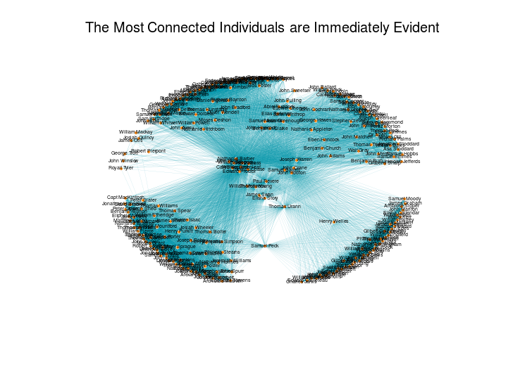
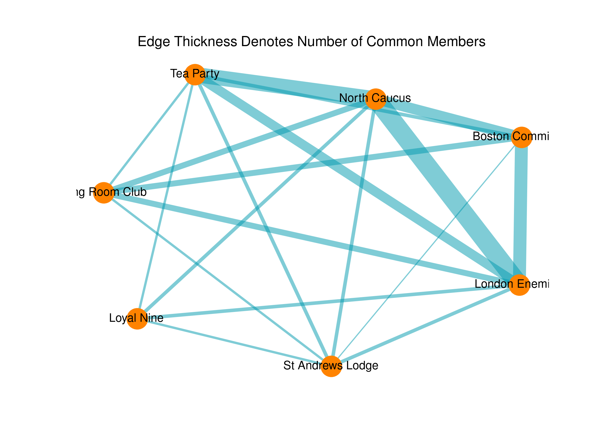

Porting [Kieran Healy](http://kieranhealy.org)'s ([@kjhealy](https://twitter.com/kjhealy)) *Paul Revere* data exploration to Python, using Pandas and NetworkX.

Tidies up people and group names, and calculates both betweenness and eigenvector centrality for the `people` graph:

Betweenness centrality:

1. Paul Revere: 0.115
2. Thomas Urann: 0.0694
3. Joseph Warren: 0.0552
4. Samuel Peck: 0.0373
5. John Hoffins: 0.0275
6. William Cooper: 0.0275
7. Nathaniel Barber: 0.0275
8. Henry Bass: 0.0267
9. Caleb Davis: 0.0267
10. Thomas Chase: 0.0267

Eigenvector centrality:

1. Paul Revere: 0.176
2. Nathaniel Barber: 0.175
3. John Hoffins: 0.175
4. William Cooper: 0.175
5. Henry Bass: 0.166
6. Caleb Hopkins: 0.166
7. William Greenleaf: 0.166
8. Caleb Davis: 0.166
9. Thomas Chase: 0.166
10. Edward Proctor: 0.157

The notebook's available to be viewed online [here](http://nbviewer.ipython.org/github/urschrei/revere/blob/master/revere.ipynb)

### TODO
Output to D3. Maybe use Bokeh / Vincent

---

### Original README text
A little network analysis example. The data come from an appendix to David Hackett Fischer's *Paul Revere's Ride* (Oxford University Press, 1995). Put up to accompany this blog post: http://kieranhealy.org/blog/archives/2013/06/09/using-metadata-to-find-paul-revere
