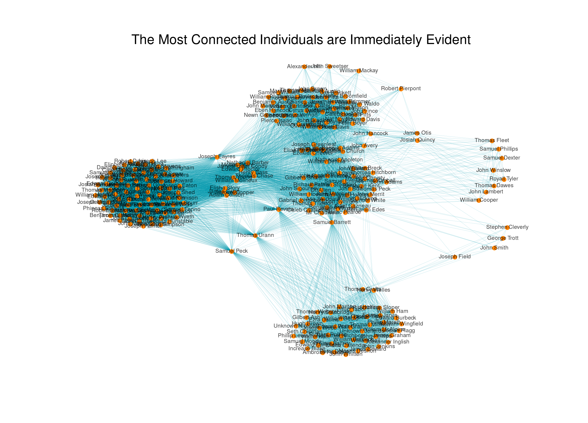

Porting Kieran Healy's (http://kieranhealy.org/[@kjhealy](https://twitter.com/kjhealy)) *Paul Revere* data exploration to Python, using Pandas and NetworkX.

Tidies up people and group names, but doesn't yet implement Bonacich.

The notebook's available to be viewed online [here](http://nbviewer.ipython.org/github/urschrei/revere/blob/master/revere.ipynb)

### TODO
Output to D3. Maybe use Bokeh / Vincent

### Original README text
A little network analysis example. The data come from an appendix to David Hackett Fischer's *Paul Revere's Ride* (Oxford University Press, 1995). Put up to accompany this blog post: http://kieranhealy.org/blog/archives/2013/06/09/using-metadata-to-find-paul-revere/

